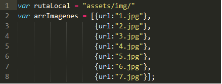
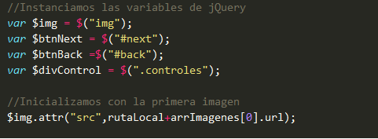
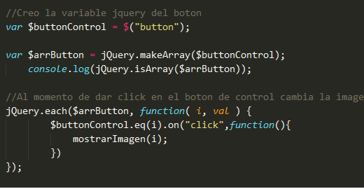
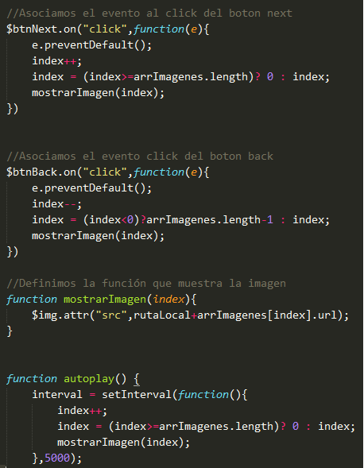

# My Slider con Jquery

## Objetivos
El presente trabajo tiene como objetivo
- Practicar la sintaxis de jQuery
- Mostrar comprensión enn el uso de eventos y selectores básicos de jQuery

## Fuentes consultadas:
- jQuery: url(http://api.jquery.com/)

## Funcionalidad

### Arry de imagenes
Almacenamos las imagenes en un array de objetos, para hacerlo funcional  

### Variables JQuery
Luego de realizar el layout en el html se crean las variables jquery 

### Botones de Control
Utilizando Jquery creamos los elementos button que serán los controles para cada imagen  	

### Event Handler
Asociamos los eventos a la interacción con el usuario, tanto para los controles como para la navegación con los botones next y back 

## Como me veo

## Desarrollado con:

`HTML` `Jquery` `CSS`  

##  Créditos
* [Lourdes Vilchez](https://github.com/lulublondet)

